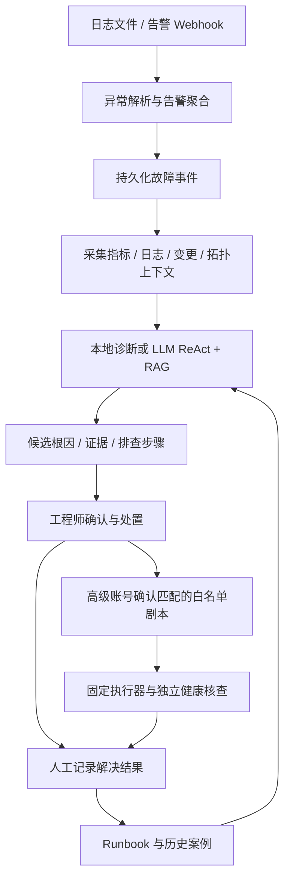

# AgentDevops

基于 ReAct Agent + RAG 的 SRE 运维日志故障诊断智能体。

本文档对应 **`codex/account-remediation` 分支，版本 `0.3.0`**。系统持续读取服务器、Nginx、Docker 和 Kubernetes 日志，或接收告警 Webhook，自动发现异常并生成故障事件。诊断结果包含候选根因、原始证据、知识引用和排查步骤；工程师在事件工作台完成确认、处置与复盘。

本分支新增四级个人账号、低等级告警的白名单处置审批、候选故障关联、历史案例回灌和诊断反馈。密码要求已统一为 **9 个字符或以上，上限 1024 个字符**。

[快速启动](#快速启动) · [账号权限](#账号权限) · [处置执行](#白名单处置与执行器) · [配置部署](#配置与部署) · [API](#api) · [测试与排障](#验证与常见问题)

## 功能概览

| 功能 | 当前实现 |
| --- | --- |
| 自动发现异常 | 增量监听日志文件，支持轮转、截断、未完成行与重启后游标恢复；接收普通 JSON 和 Alertmanager 告警 |
| 日志解析 | 自动识别服务器、Nginx、Docker、Kubernetes 来源，提取严重度、故障类型和证据行；支持 `k8s` 来源别名 |
| 故障诊断 | 本地规则诊断或可配置的大模型 ReAct 工具循环，输出候选根因、排查步骤、预期结果与信息缺口 |
| RAG 知识检索 | 内置 26 条 Runbook，使用 BM25 检索，保留原文片段、来源链接、可信等级和更新时间 |
| 事件工作台 | 自动聚合重复告警，支持确认、补充诊断、恢复核查、合并、拆分、记录解决与 Markdown 复盘导出 |
| 账号分级 | 观察员、初级工程师、高级工程师、管理员；个人登录、会话撤销、账号停用与权限校验 |
| 辅助处置 | 高级工程师或管理员确认后执行已审核的固定 HTTP 剧本，并调用独立接口核查恢复 |
| 候选故障关联 | 根据时间窗口、共同实例或同服务同类型展示关联分组与关联依据 |
| 历史学习 | 真实事件的人工处置记录回灌知识检索，按诊断版本收集“有用 / 没用”反馈 |
| 持久化与审计 | SQLite 保存账号、事件、诊断版本、游标、学习记录与执行计划，记录身份和关键操作 |

### 常见故障识别范围

| 日志来源 | 常见识别类型 |
| --- | --- |
| Linux 服务器 | OOM、磁盘空间不足、认证失败、权限异常、CPU 饱和、托管临时缓存压力 |
| Nginx | 上游连接拒绝、502、504、请求超时、TLS 异常 |
| Docker | 容器崩溃、内存耗尽、镜像拉取与依赖异常 |
| Kubernetes | CrashLoopBackOff、ImagePullBackOff、FailedScheduling、探针失败、OOMKilled、Service 无可用端点 |
| 应用与依赖 | 数据库连接耗尽、慢查询、消息积压等已配置规则覆盖的异常 |

识别结果是待验证的诊断结论。单个 `Pending`、退出码 `137` 或高 load 不能独立证明根因；正常 Kubernetes Events 不会仅因出现组件名称就被判为故障。

## 快速启动

需要 Python **3.10 或以上**和 Git。后端使用 FastAPI，前端为静态 HTML/CSS/JavaScript，无需前端构建。

### 获取本分支

```bash
git clone --branch codex/account-remediation https://github.com/CcX1-Matcha/AgentDevops.git
cd AgentDevops
```

### Windows PowerShell

```powershell
python -m venv .venv
.\.venv\Scripts\python.exe -m pip install -r backend/requirements.txt
.\.venv\Scripts\python.exe -m uvicorn app:app --host 127.0.0.1 --port 8000
```

### Linux / macOS

```bash
python3 -m venv .venv
.venv/bin/python -m pip install -r backend/requirements.txt
.venv/bin/python -m uvicorn app:app --host 127.0.0.1 --port 8000
```

启动后访问：

- [事件工作台](http://127.0.0.1:8000/)
- [API 文档](http://127.0.0.1:8000/docs)
- [健康检查](http://127.0.0.1:8000/api/health)

默认 `LLM_MODE=local`，日志解析与诊断无需模型 API Key。端口已被占用时，将命令中的 `--port 8000` 改为可用端口，并使用对应地址访问。

### 首次创建管理员

1. 在部署主机上通过 `127.0.0.1` 打开工作台，点击“创建管理员”。
2. 设置账号和密码，创建后自动登录。
3. 进入“账号管理”，创建其他工程师账号并选择级别。

**没有默认账号或默认密码。** 初始化前的 `local-operator` 是本机兼容身份，没有密码，只具有初级手动权限。首次管理员创建后，匿名本机访问也需要登录。

账号为 3 至 64 个字符，首字符必须是英文字母或数字，其余可使用英文字母、数字、`.`、`_`、`-`。密码为 **9 至 1024 个字符**，没有额外的大小写、数字或符号组合要求；初始化、创建账号和修改密码使用同一规则。

也可以在项目根目录通过命令行初始化，密码以交互方式输入并确认：

```powershell
.\.venv\Scripts\python.exe -m backend.app.accounts bootstrap --username admin
```

Linux / macOS 将解释器替换为 `.venv/bin/python`。如使用自定义数据目录，设置相同的 `OPS_DATA_PATH`，或在初始化命令中追加 `--data-path <数据目录>`。

## 账号权限

权限由后端校验，账号等级决定可调用的接口和页面操作。

| 账号等级 | 角色标识 | 允许的操作 |
| --- | --- | --- |
| 观察员 | `viewer` | 查看事件、知识库、候选关联、知识质量、处置记录与审计 |
| 初级工程师 | `junior` | 观察员权限，加手动诊断、确认事件、补充信息、合并拆分、恢复核查、记录解决、提交反馈和立即采集 |
| 高级工程师 | `senior` | 初级权限，加生成并确认执行低等级事件的白名单处置计划 |
| 管理员 | `admin` | 高级权限，加查看和管理账号、管理数据源、导入知识 |

密码采用带盐 scrypt 哈希保存。个人会话有效期为八小时，数据库只保存令牌的 SHA-256 摘要；退出会撤销当前会话，修改密码、角色或启用状态会撤销该账号已有会话。最后一个有效管理员不能被停用或降级。

兼容令牌权限如下：

| 环境变量 | 权限 |
| --- | --- |
| `OPS_API_TOKEN` | 初级手动操作权限 |
| `OPS_READ_TOKEN` | 只读权限 |
| `ALERT_WEBHOOK_TOKEN` | 仅允许 `POST /api/alerts/webhook` 接入告警 |

共享令牌不具备账号管理或剧本执行权限。高级处置需要使用高级工程师或管理员的个人会话。当前尚未接入 SSO、MFA 和按服务划分的多租户授权。

## 体验自动发现与辅助处置

默认提供五个标记为演示的日志数据源：Nginx、Docker、Kubernetes、Linux 和低等级缓存告警。

1. 以管理员或初级以上账号登录，在“故障事件”选择场景并点击“注入演示异常”。
2. 系统将异常写入演示日志，后台采集器自动发现，建立事件并完成诊断。
3. 打开事件，查看候选根因、证据行、知识引用、排查步骤和工具轨迹。
4. 选择“低等级缓存告警”，以高级工程师或管理员身份生成处置计划。
5. 核对目标、审核人、回滚说明和有效期，点击“审阅并执行”并确认。
6. 查看执行状态与审计记录；初级账号继续使用人工处置流程。

演示剧本只追加模拟恢复日志，返回 `simulated`，健康状态保持未知，不修改真实服务。生产环境可设置 `OPS_DEMO_ENABLED=false` 关闭演示。演示数据不参与真实事件的历史案例回灌与质量统计。

## 工作流程与诊断模式



系统默认按服务、环境、实例、来源和故障类型，在五分钟窗口内聚合重复告警。自动诊断完成后进入“待确认”，支持补充日志、重新诊断、确认方案、恢复核查和记录解决。恢复核查保留缺失证据，不把“没有新增错误”视为已经恢复。

### 本地模式与 LLM 模式

| 模式 | 行为 |
| --- | --- |
| `LLM_MODE=local` | 确定性规则解析、上下文整理与 BM25 检索，输出待验证原因；置信度为启发式分值 |
| `LLM_MODE=llm` | OpenAI 兼容 Chat Completions 模型在有界 ReAct 循环中调用工具，提交经服务端校验的诊断 |

LLM 模式使用 `parse_logs`、`collect_context`、`retrieve_knowledge`、`finish` 工具。上下文来自本轮只读采集结果；补充信息或重新诊断会触发新一轮采集。服务端校验证据行、知识 ID、步骤引用、严重度和工具顺序。界面显示检查假设、动作与结果摘要，不展示模型私有思维链。

接入已启动、已加载模型且支持工具调用的本地兼容服务，例如：

```powershell
$env:LLM_MODE = "llm"
$env:LLM_BASE_URL = "http://127.0.0.1:11434/v1"
$env:LLM_MODEL = "qwen2.5:7b"
.\.venv\Scripts\python.exe -m uvicorn app:app --host 127.0.0.1 --port 8000
```

远端模型服务还需设置 `LLM_API_KEY`。`LLM_MAX_ITERATIONS` 默认 8，`LLM_TIMEOUT_SECONDS` 默认 30 秒。使用远端模型时，诊断日志和上下文会发送到配置的模型服务。

自动事件诊断在 LLM 超时或协议异常时会降级到本地模式，保留原因并写审计。手动 `POST /api/diagnose` 对相应异常返回 502 / 503 / 504。原始日志和外部数据作为不可信数据处理，不作为工具指令。当前 RAG 为 BM25 检索，尚未实现向量检索或 Rerank。

## 接入真实日志与告警

### 文件日志

管理员可在“数据源”填写日志路径、来源、服务、环境和实例，也可通过 `OPS_SOURCES_PATH` 在启动时加载 JSON 数组。参考 [数据源配置示例](config/sources.example.json)。

```json
[
  {
    "name": "订单网关 Nginx",
    "path": "/var/log/nginx/error.log",
    "source": "nginx",
    "service": "orders-gateway",
    "environment": "production",
    "instance": "node-01",
    "enabled": true,
    "read_existing": false,
    "poll_interval_seconds": 2
  }
]
```

路径必须能被运行 Agent 的进程读取。Windows JSON 路径可写为 `"C:\\logs\\nginx\\error.log"`；Docker 配置须使用容器内路径。默认只读取接入后的新增内容，`read_existing=true` 或页面勾选“读取已有日志”才扫描历史内容。

采集器单次读取最多 256 KiB，保存文件游标；路径或权限问题会显示采集失败。远端服务器需要日志转发或挂载，Kubernetes 需要现有采集器输出 Events / Pod 日志或告警。当前服务不读取 kubeconfig，也不会直接扫描集群。

### Webhook 告警

接收地址：`POST /api/alerts/webhook`。支持普通 JSON 和 Alertmanager 格式，使用 `Authorization: Bearer <ALERT_WEBHOOK_TOKEN>` 接入。

普通告警示例：

```json
{
  "service": "orders-api",
  "environment": "production",
  "instance": "node-01",
  "source": "kubernetes",
  "severity": "error",
  "message": "kubelet Warning BackOff CrashLoopBackOff in pod orders-api",
  "fingerprint": "orders-crashloop-01",
  "starts_at": "2026-10-02T08:00:00Z"
}
```

### 监控与变更上下文

设置 `CONTEXT_CONFIG_PATH`，参考 [上下文配置示例](config/context.example.json)。每轮事件诊断并行查询固定配置的 Prometheus、Loki、变更和拓扑 HTTP 接口。

- Prometheus、Loki 使用原生查询 API。
- 变更和拓扑接口接收 `service/instance/start/end` GET 参数并返回 JSON，需要适配现有平台。
- 默认覆盖故障前一小时，窗口上限六小时，请求有超时和响应大小限制。
- 未配置为 `not_configured`，超时、权限或格式问题为 `failed`；诊断保留信息缺口，未知影响为 `null`。

## 白名单处置与执行器

诊断中的命令是排查建议，标记 `advice_only`。辅助执行通过服务端配置的固定 HTTP 执行器完成，不将模型生成的命令交给 shell。

执行计划需要同时满足：

1. 操作人是高级工程师或管理员，使用有效的个人会话。
2. 事件已有完成的诊断，处于待确认或已确认状态，尚未解决。
3. 事件、诊断和原始日志的最高严重度均不超过 `warning`，分类一致。
4. 已审核剧本明确匹配来源、服务、环境、实例和故障类型。
5. 工程师核对目标与回滚说明，明确确认执行。

计划有效期为十分钟，诊断、告警、事件或配置变化会使计划失效。执行使用计划 ID 作为幂等键；同事件不重复执行，同目标在执行中、结果未知或最近十分钟执行过时会阻止新操作。超时或中断保留结果未知，不自动重试。

真实执行需自行提供执行器，并配置 `REMEDIATION_CONFIG_PATH`，参考 [处置配置示例](config/remediation.example.json)。支持的动作标识为 `cleanup_managed_temp`、`restart_stateless_workload`、`switch_standby`；具体处理逻辑由执行器实现，服务负责人需审核作用范围和回滚步骤。

执行接口使用固定 HTTPS 地址，本机回环开发可用 HTTP。认证通过 `token_env` 引用环境变量；恢复通过独立 GET 健康接口检查，接口必须返回对应计划、布尔健康状态和有效核查时间。执行完成不自动把事件标记为已解决，最终状态仍由工程师确认。

执行器请求、响应、健康核查和失效规则的详细协议见 [v0.3 升级说明](docs/UPGRADE_0.3.md)。

## 知识库、关联与反馈

管理员可以导入结构化 Runbook，接受 JSON 数组或 `{ "documents": [...] }`，参考 [知识导入示例](config/knowledge_import.example.json)。检索保留来源、原文片段、更新时间和可信等级。

真实事件填写处置记录并标记解决后，系统自动保存历史案例并回灌检索，可信等级为 `personal`。候选根因、人工结果和恢复核查分别保存，健康未知不会被改写为正常；案例不会自动晋升为已审核知识。人工复核后可导入标记为 `reviewed` 的知识，不直接覆盖内置条目。

每个账号对每个诊断版本可提交一条可更新的“有用 / 没用”反馈。知识质量页统计真实事件的人工建议有用率；某条 Runbook 至少有三条反馈且负面超过一半时，标记待复核。

候选关联默认使用十分钟窗口，根据共同实例或同服务同故障类型给出依据。不同环境、演示与真实事件分开处理，未知标签不作为关联证据。关联线索不能证明共同根因，当前不生成跨事件统一根因。

人工建议有用率不等于根因准确率或执行成功率。未获得标注数据的准确率与建议采纳率保持 `null`；MTTR 根据已记录的真实事件解决时间计算。

## 配置与部署

完整环境变量示例见 [.env.example](.env.example)。本地运行可设置环境变量，或创建 `.env` 后启动：

```powershell
.\.venv\Scripts\python.exe -m uvicorn app:app --env-file .env --host 127.0.0.1 --port 8000
```

| 变量 | 默认值 / 用途 |
| --- | --- |
| `OPS_DATA_PATH` | 项目 `data/`；保存数据库、游标、导入知识与演示日志 |
| `OPS_DEMO_ENABLED` | `true`；生产可设为 `false` |
| `OPS_SOURCES_PATH` | 可选；启动时加载的数据源 JSON 文件 |
| `CONTEXT_CONFIG_PATH` | 可选；只读上下文接口配置文件 |
| `REMEDIATION_CONFIG_PATH` | 可选；真实白名单处置配置文件 |
| `KNOWLEDGE_PATH` | 默认内置 `knowledge_base/incidents.json`；可指定知识文件 |
| `LLM_MODE` | `local` 或 `llm` |
| `LLM_BASE_URL` | 默认 `http://127.0.0.1:11434/v1`；兼容模型服务地址 |
| `LLM_MODEL` | 默认 `qwen2.5:7b`；需与模型服务实际名称一致 |
| `LLM_API_KEY` | 使用远端模型服务时必需 |
| `LLM_MAX_ITERATIONS` | `8`；ReAct 工具循环上限 |
| `LLM_TIMEOUT_SECONDS` | `30`；单轮 LLM 诊断时间预算 |
| `OPS_API_TOKEN` / `OPS_READ_TOKEN` | 可选兼容手动 / 只读令牌；内置 Compose 必需设置 `OPS_API_TOKEN` |
| `ALERT_WEBHOOK_TOKEN` | 告警接入令牌 |
| `CACHE_EXECUTOR_TOKEN` | 示例缓存执行器密钥，由处置配置的 `token_env` 引用 |

### Docker Compose

1. 根据 `.env.example` 创建 `.env`，取消 `OPS_API_TOKEN` 的注释并填入随机令牌；内置 Compose 要求该值非空。
2. 配置真实日志或执行器时，在 `.env` 中使用容器内路径，例如 `OPS_SOURCES_PATH=/app/config/sources.json`、`REMEDIATION_CONFIG_PATH=/app/config/remediation.json`。
3. 启动服务：

```bash
docker compose up --build -d
```

首次管理员在容器内通过 CLI 初始化，交互输入并确认密码：

```bash
docker compose exec sre-diagnosis python -m backend.app.accounts bootstrap --username admin
```

然后通过 [工作台](http://127.0.0.1:8000/) 登录。容器端口转发不等于容器内回环访问，因此 Docker 首次初始化使用上述 CLI。

Compose 绑定 `127.0.0.1:8000`，`ops-data` 持久卷保存 `/app/data`，项目 `config/` 以只读方式挂载到 `/app/config`。真实日志需额外挂载为只读，例如 `- /var/log/nginx:/logs/nginx:ro`，数据源配置填写 `/logs/nginx/error.log`。

内置 Compose 透传示例 `CACHE_EXECUTOR_TOKEN`；自定义 `token_env` 时，需要把对应变量加入 Compose 的 `environment`。Docker 中模型服务的默认地址为 `http://host.docker.internal:11434/v1`，应根据宿主机网络与实际模型服务调整。启用 `llm` 模式时，此地址在容器内属于非回环地址，需要按兼容服务要求填写非空 `LLM_API_KEY`。

### 运行数据与部署边界

`data/operations.sqlite3` 保存事件、游标、学习和处置记录，`data/accounts.sqlite3` 保存账号及会话。导入知识也位于数据目录。备份时停止服务并保留整个数据目录；不要通过删除数据库处理登录问题。

`.gitignore` 已排除 `data/`、`artifacts/`、`.env` 和真实配置 `config/sources.json`、`config/context.json`、`config/remediation.json`，仓库提交的是示例配置。对外部署使用 HTTPS 传输登录信息；异站写入请求会被拒绝。

保持**单个 Uvicorn worker**运行，多 worker 会重复启动文件监听器。生产高可用、集中任务队列、SSO/MFA、多租户隔离和 SLA 需要进一步实现与验收。

## API

`/api/health` 与 `/api/auth/me` 可匿名读取。登录和首次初始化接口不要求已有会话，初始化仍受本机和首次创建条件限制。其余业务 API 受账号或兼容令牌权限控制。个人登录返回 `token`，后续请求使用 `Authorization: Bearer <token>`。

### 身份与账号

| 方法 | 路径 | 用途 |
| --- | --- | --- |
| GET | `/api/health` | 健康状态、版本、诊断模式与配置错误 |
| GET | `/api/auth/me` | 当前身份、权限和初始化可用状态 |
| POST | `/api/auth/bootstrap` | 首次本机管理员初始化 |
| POST | `/api/auth/login` | 个人账号登录 |
| POST | `/api/auth/logout` | 撤销当前个人会话 |
| GET | `/api/accounts` | 管理员查看账号列表 |
| POST | `/api/accounts` | 管理员创建账号 |
| PATCH | `/api/accounts/{account_id}` | 管理员修改角色、启用状态或密码 |

### 采集与事件

| 方法 | 路径 | 用途 |
| --- | --- | --- |
| GET | `/api/overview` | 事件统计、聚合率与数据源健康 |
| GET / POST | `/api/sources` | 查看 / 创建数据源 |
| PATCH / DELETE | `/api/sources/{source_id}` | 修改名称、开关与轮询间隔 / 删除数据源 |
| POST | `/api/sources/{source_id}/scan-now` | 立即只读采集 |
| POST | `/api/alerts/webhook` | 接收普通告警或 Alertmanager 告警 |
| POST | `/api/demo/events` | 注入演示日志异常 |
| GET | `/api/incidents` | 事件列表 |
| GET | `/api/incidents/{event_id}` | 事件详情、诊断版本与时间线 |
| PATCH | `/api/incidents/{event_id}` | 确认方案或记录解决结果 |
| POST | `/api/incidents/{event_id}/followup` | 补充信息与日志，重新采集并诊断 |
| POST | `/api/incidents/{event_id}/verify` | 核查恢复证据与信息缺口 |
| POST | `/api/incidents/{event_id}/merge` | 人工合并事件 |
| POST | `/api/incidents/{event_id}/split` | 按原始告警拆分事件 |
| GET | `/api/incidents/{event_id}/export` | 导出 Markdown 复盘初稿 |
| GET | `/api/audit` | 审计记录 |
| POST | `/api/diagnose` | 独立手动日志诊断 |

### 知识、学习与处置

| 方法 | 路径 | 用途 |
| --- | --- | --- |
| GET | `/api/knowledge` | 知识列表 |
| GET | `/api/knowledge/search` | 知识检索，使用 `q` 与 `limit` 参数 |
| POST | `/api/knowledge/import` | 管理员导入结构化 Runbook |
| GET | `/api/campaigns` | 候选关联分组 |
| GET | `/api/learning/metrics` | 人工建议有用率与知识复核标记 |
| GET | `/api/incidents/{incident_id}/learning` | 事件历史案例与反馈信息 |
| POST | `/api/incidents/{incident_id}/feedback` | 按诊断版本提交或更新反馈 |
| GET | `/api/incidents/{event_id}/remediation` | 匹配剧本与已有计划 |
| POST | `/api/incidents/{event_id}/remediation/plans` | 生成计划，提交 `{"playbook_id":"..."}` |
| POST | `/api/remediation/plans/{plan_id}/execute` | 高级账号执行，提交 `{"confirmed":true}` |

### 手动诊断示例

以下 PowerShell 示例使用已创建的账号，密码位置需替换为该账号的密码：

```powershell
$loginBody = @{ username = "admin"; password = "<你的密码>" } | ConvertTo-Json
$session = Invoke-RestMethod -Uri "http://127.0.0.1:8000/api/auth/login" -Method Post -ContentType "application/json" -Body $loginBody
$headers = @{ Authorization = "Bearer $($session.token)" }
$diagnosisBody = @{
    source = "k8s"
    logs = "kubelet: Warning BackOff restarting failed container api in pod orders-api; Reason: CrashLoopBackOff"
} | ConvertTo-Json
Invoke-RestMethod -Uri "http://127.0.0.1:8000/api/diagnose" -Method Post -Headers $headers -ContentType "application/json" -Body $diagnosisBody
```

响应包含 `root_cause`、`failure_type`、`severity`、`confidence`、`evidence`、`steps`、`knowledge`、`trace` 与 `missing_information`。该接口返回独立诊断；持续检测与事件处置使用数据源或 Webhook 工作流。

## 项目结构

```text
AgentDevops/
  app.py                        # 兼容启动入口
  backend/
    app/
      main.py                   # FastAPI 与后台服务初始化
      parser.py                 # 日志解析和异常识别
      agent.py / llm.py         # 本地诊断与 LLM ReAct
      knowledge.py / rag.py     # 知识存储和检索
      context.py                # 只读上下文采集
      operations.py             # 增量采集、事件聚合与审计
      accounts.py / security.py # 个人账号、会话与权限
      remediation.py            # 白名单计划、执行与恢复核查
      improvements.py           # 候选关联、历史案例与反馈
      knowledge_api.py          # 知识导入与持久化
    tests/                      # 后端回归测试
    requirements.txt
  frontend/                     # 中文事件工作台
  knowledge_base/incidents.json # 内置 Runbook
  config/                       # 数据源、上下文、知识与处置示例
  examples/                     # 示例日志，包括 Kubernetes 场景
  tests/                        # 知识检索与导入测试
  docs/                         # PRD 实现范围与升级协议
  data/                         # 本地运行数据，不提交 Git
  docker-compose.yml
  Dockerfile
```

## 验证与常见问题

本分支功能升级已通过 214 项 Python 测试，覆盖采集与游标恢复、告警聚合、Kubernetes 识别、诊断证据、LLM 降级、账号权限、9 字符密码边界、执行幂等和知识持久化。

测试应使用独立的空数据目录，避免已有账号使旧测试的匿名请求被拒绝，也避免测试写入正式事件库。使用未设置访问令牌的测试终端，运行：

```powershell
.\.venv\Scripts\python.exe -m pip install pytest
$env:LLM_MODE = "local"
$env:OPS_DATA_PATH = Join-Path $env:TEMP ("agentdevops-tests-" + [guid]::NewGuid().ToString("N"))
.\.venv\Scripts\python.exe -m pytest -q
```

该 `OPS_DATA_PATH` 只用于当前测试终端；后续启动正式服务时使用原数据目录。

| 现象 | 检查方式 |
| --- | --- |
| 端口已被占用 | 使用其他 `--port`，并同步访问地址 |
| 登录后出现 401 | 检查会话是否过期、账号是否停用或角色 / 密码是否被修改，重新登录 |
| 请求返回 403 | 检查账号级别；共享令牌不能执行剧本或管理账号 |
| 真实日志未生成事件 | 检查日志路径、读取权限、数据源开关和严重度；默认只读取新增日志 |
| 高级账号没有可执行剧本 | 检查最高严重度、诊断状态及剧本目标与故障类型是否精确匹配 |
| 执行状态为 unknown | 在执行器侧核对实际结果和幂等键，系统不会自动重放操作 |
| 上下文缺失或模型不可用 | 查看 `/api/health`、连接器状态及诊断中的缺失信息或降级原因 |

更多实现说明：

- [v0.3 升级说明与执行器协议](docs/UPGRADE_0.3.md)
- [PRD 实现范围与待接入能力](docs/PRD_IMPLEMENTATION.md)

尚未接入的能力包括混合向量检索、标注评测集、资源趋势预测、值班升级通知、流式诊断、Trace 和 IM 双向交互。当前指标与诊断输出仅反映实际接入的数据，生产准确率和 SLA 需要真实数据与压测验收。
